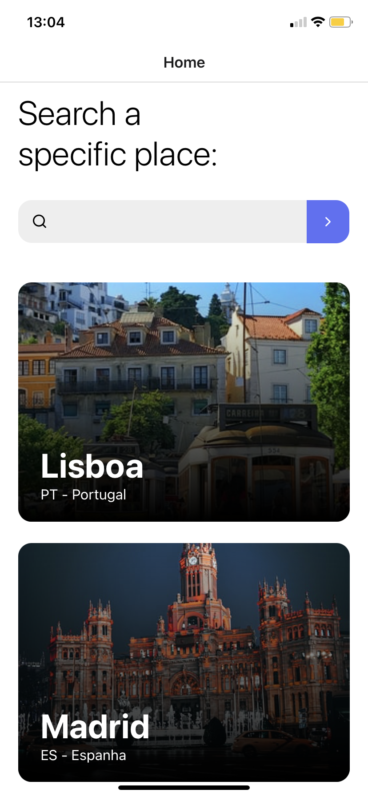
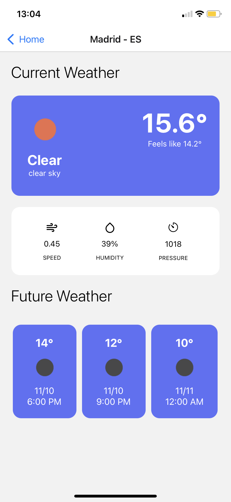

# WeatherWIT
 Weather App Challenge

[](https://github.com/danielj06)
[](#)

<hr />

# :eye: Preview




# :pushpin: Table of Contents

* [Features](#brain-features)
* [Installation](#construction_worker-installation)
* [Technologies](#computer-technologies)

# :brain: Features

* List 10 european cities
* Search for a specific city
* Get weather details from each city
* Get future weather info from each city

# :construction_worker: Installation

Run this: ``` yarn install ```
Then: ``` yarn start ```

# :computer: Technologies

* Expo
* Typescript
* Axios
* Styled-components
* Lottie
* Reactotron
* Eslint
* Prettier

# Structure

src
 - components
 - pages
 - routes
 - service
 - utils
